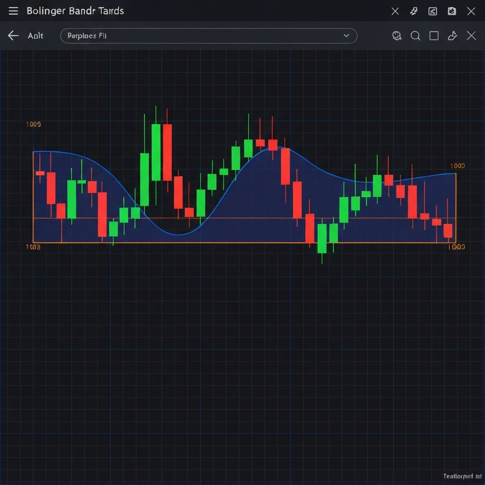
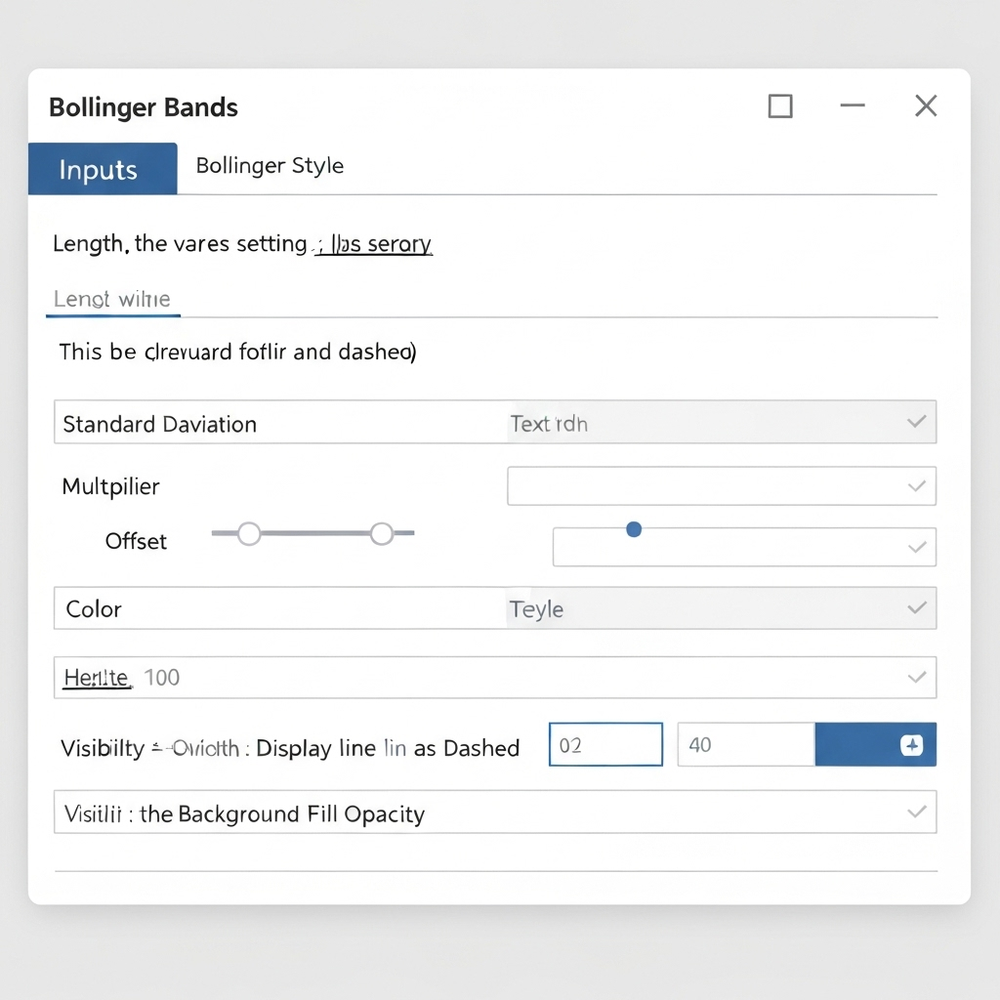

# Bollinger Bands (KLineCharts)

A minimal, responsive Bollinger Bands indicator demo built with:
- Next.js (App Router) + TypeScript
- Tailwind CSS v4 + shadcn/ui components
- KLineCharts v9.8.7

Live UI includes an Inputs tab (Length, StdDev multiplier, Offset) and a Style tab (toggle/color/width/style for Basis/Upper/Lower + background band fill with opacity). The chart auto-resizes and ships with 300 demo candles.

## Screenshots

## Setup / Run

\`\`\`bash
npm install
npm run dev
# open https://bollinger-bands-frontend.vercel.app/
\`\`\`

Build/serve:
\`\`\`bash
npm run build
npm start
\`\`\`

## Where things live

- Chart + settings UI: `components/bbands-chart.tsx`
- Indicator registration: `lib/register-bbands.ts` (indicator name: `BBANDS_V0`)
- Demo OHLCV generator: `lib/generate-ohlc.ts`
- Page entry: `app/page.tsx`

## Formulas

- Basis = SMA(close, length)
- StdDev = sqrt(E[x^2] − (E[x])^2) computed as population variance over the last `length` closes
  - This matches the population standard deviation (not sample), which keeps bands stable and aligns with many charting platforms by default.
- Upper = Basis + (multiplier × StdDev)
- Lower = Basis − (multiplier × StdDev)
- Offset shifts the three series by N bars (positive = forward/right)

## Features checklist

- [x] Inputs: Length (default 20), StdDev multiplier (default 2), Offset (default 0)
- [x] Style: toggle/color/width/line-style for Basis, Upper, Lower
- [x] Background fill between Upper/Lower with adjustable opacity
- [x] Tooltip/crosshair shows Basis/Upper/Lower (indicator figures)
- [x] ≥ 300 demo candles generated locally
- [x] Responsive layout with ResizeObserver-driven chart resizing
- [x] Technologies used: Next.js + TS + Tailwind + shadcn/ui + KLineCharts

## KLineCharts version

- Explicit dependency: `klinecharts@9.8.7`

## How to use

1) Click “Add indicator” to attach BBANDS to the candle pane.  
2) Open “Settings” to tweak Inputs/Style; changes apply instantly.  
3) Hover the crosshair to see Basis/Upper/Lower.

## License

MIT
#
